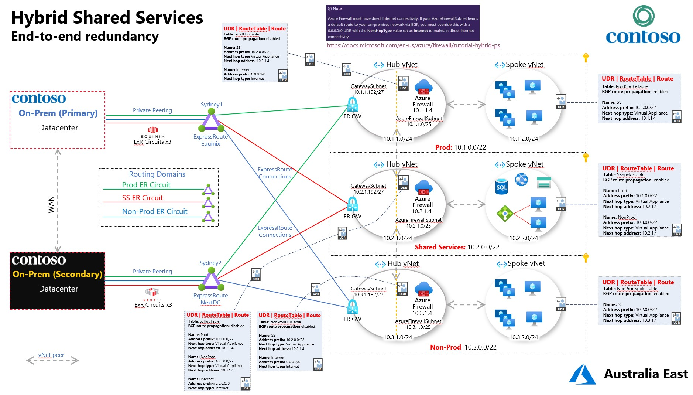

HybridSharedServices
====================

The **Hybrid Shared Services** model makes use of a traditional hub & spoke
Azure vNet design by leveraging a **Shared Services** environment in Azure and
separate **Prod** & **Non-Prod** environments. Both **Prod** & **Non-Prod** can
talk **to Shared Services**, but **Prod** & **Non-Prod** are completely isolated
from one another.

From on-prem there's separate & isolated access to each of the 3 routing
domains.

Redundancy is within region, leveraging the two separate ExpressRoute peering
locations in Sydney.

Optimise Routing
----------------

-   Assign a higher weight to the local connection than to the remote connection

-   You can also influence routing from VNet to your on-premises network, if you
    have multiple ExpressRoute circuits, by configuring the weight of a
    connection instead of applying AS PATH prepending. For each prefix, we will
    always look at the connection weight before the AS Path length when deciding
    how to send traffic.

<https://docs.microsoft.com/en-us/azure/expressroute/expressroute-optimize-routing>

Deployment
----------

