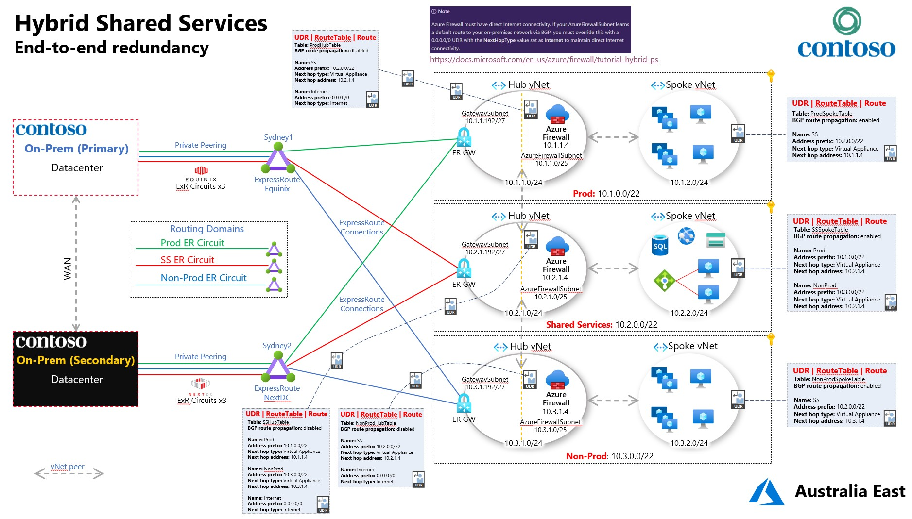

HybridSharedServices
====================

Hybrid Shared Services makes use of a traditional hub & spoke vNet design by
leveraging Shared Services in Azure and separate Prod & Non-Prod environments.
Both Prod & Non-Prod can talk to Shared Services, but Prod & Non-Prod are
completely isolated from one another.

From on-prem there's separate access to each of the 3 routing domains.

## Deployment

